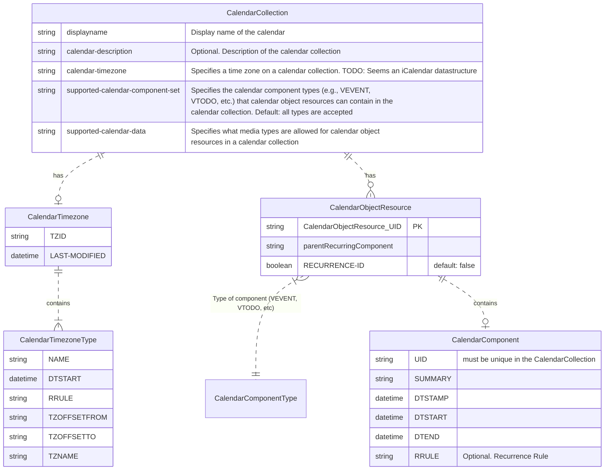

# CalDAV compatible API implementation

The objective of this project is to implement API's which are compatible with the CalDAV specification.

The main initial focus are the resources which will be useful to create a TODO application.

## CalDAV Standard

`Calendaring Extensions to WebDAV (CalDAV)` is a standard specified on [RFC 4791](https://www.rfc-editor.org/rfc/rfc4791), which defines a way to access, manage and share calendaring and scheduling information.

Some notes from the specification:

1. _a CalDAV calendar is modeled as a WebDAV collection with a defined structure_.
2. _each calendar collection contains a number of resources representing calendar objects as its direct child resource_.
3. _Each resource representing a calendar object (event, to-do, journal entry, or other calendar components) is called a "calendar object resource"_.
4. _Each calendar object resource and each calendar collection can be individually locked and have individual WebDAV properties_
5. _Calendar object resources contained in calendar collections MUST NOT contain more than one type of calendar component (e.g., VEVENT,    VTODO, VJOURNAL, VFREEBUSY, etc.) with the exception of VTIMEZONE    components, which MUST be specified for each unique TZID parameter    value specified in the iCalendar object.  For instance, a calendar    object resource can contain one VEVENT component and one VTIMEZONE    component, but it cannot contain one VEVENT component and one VTODO    component.  Instead, the VEVENT and VTODO components would have to be stored in separate calendar object resources in the same collection_

Types of calendar components are:
 - VEVENT
 - VTODO
 - VJOURNAL
 - VFREEBUSY
 - VTIMEZONE (this last one might co-exist with the others)

## Methods

New calendar object resources MUST be created with a PUT request targeted at an
   unmapped URI.  A PUT request targeted at a mapped URI updates an
   existing calendar object resource.
  - the client SHOULD use
   the HTTP request header "If-None-Match: *" on the PUT request.  The
   Request-URI on the PUT request MUST include the target collection,
   where the resource is to be created, plus the name of the resource in
   the last path segment.  The "If-None-Match: *" request header ensures
   that the client will not inadvertently overwrite an existing resource
   if the last path segment turned out to already be used.